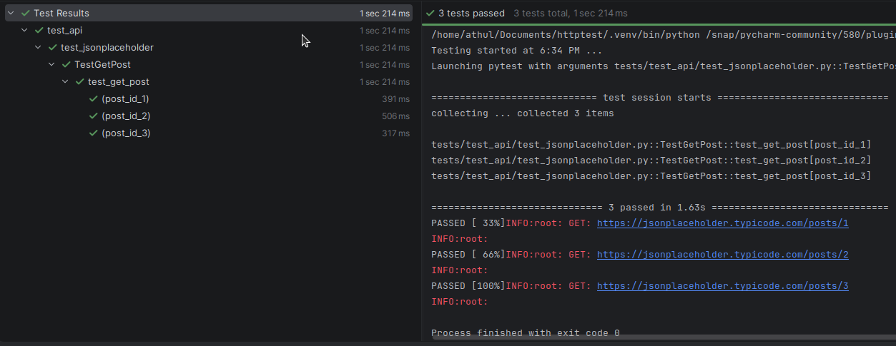
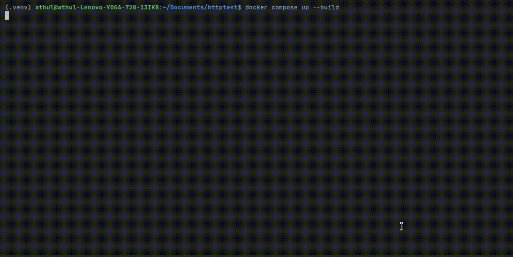

## httptest

A simple Python framework to write tests for HTTP endpoints.

## Getting Started

`httptest` is a scalable framework to write parameterized tests for HTTP endpoints, and run them concurrently in a Docker container. The core `Endpoint` class is a `requests` wrapper which provides the `GET`, `PUT`, `POST`, `PATCH`, `DELETE` http methods. 

You can define a class for any HTTP endpoint, using `Endpoint` as the base class.
```python
from httptest.endpoint import Endpoint

BASE_URL = "https://jsonplaceholder.typicode.com"

class GetPost(Endpoint):
  """
  Endpoint for fetching a single post by ID from JSONPlaceholder API.
  """

  def __init__(self, post_id: int) -> None:
    self.url = f"{BASE_URL}/posts/{post_id}"
    self.response = self.get(url=self.url)

```
You can define a list of test cases for the endpoint as follows:
```python
get_post_params = [
  {"post_id": 1},
  {"post_id": 2},
  {"post_id": 3},
]
```
You can then write a parametrized test as follows:
```python
import pytest

from httptest.endpoints.jsonplaceholder import GetPost
from httptest.utils.validate import Base, param_id
from params.jsonplaceholder import get_post_params

class TestGetPost(Base):
  @pytest.mark.parametrize("params", get_post_params, ids=param_id)
  def test_get_post(self, params):
    self.response = GetPost(**params)
    self.validate()
```
Example test run using Pycharm:

You can add as many endpoints as you want to, with a corresponding list of parameters, and test cases which exercise the endpoints with parameter cases, and do whatever validations you wish to.

### Using Auth
The example shown above does not require authentication. `httptest` provides two common auth modes: `BEARER_TOKEN`and `ACCESS_KEY_SECRET_KEY` which adds auth headers as follows:
- `headers["Authorization"] = f"Bearer {bearer_token}"`
- `headers["Authorization"] = f"basic {access_key}:{secret_key}"`

To use the auth methods, use the `add_auth(mode="BEARER_TOKEN")` in the endpoint definition. Other auth methods can be defined, or added as required using `headers` in the endpoint definition.
```python
from httptest.endpoint import Endpoint

BASE_URL = "https://jsonplaceholder.typicode.com"

class GetPost(Endpoint):
  """
  Endpoint for fetching a single post by ID from JSONPlaceholder API.
  """

  def __init__(self, post_id: int) -> None:
    self.add_auth(mode="BEARER_TOKEN")
    self.url = f"{BASE_URL}/posts/{post_id}"
    self.response = self.get(url=self.url)
```
The `BEARER_TOKEN` environment variable must be set in this case for use.

## Setup Instructions
- Clone the repository.
- Using `uv`
  - `uv sync`
  - `source .venv/bin/activate`
- Using `Virtualenv`
  - `python3 -m venv .venv`
  - `source .venv/bin/activate`
  - `pip install -r requirements.txt`

### Running the tests in Docker
- To run the tests in the Docker container, run:
```
docker compose up --build
```

#### Additional configuration
By default, the tests will use all available CPU cores. To explicitly how many cores to use, set the desired `NUM_CORES` in the `.env` file. You can set the `NUM_CORES` to a higher value than the number of available cores. For example, if you have 2 cores and you set `NUM_CORES=16`, it will create 8 workers per CPU. This is possible because all tests are independent, and are primarily I/O bound (waiting for API responses) allowing multiple workers to run on a CPU. However, setting a very high number of workers will lead to diminishing returns due to context switching overhead.

## Contributing
Contributions are welcome! Please feel free to submit a pull request or open an issue.

If you want to contribute, please follow these guidelines:
- Fork the repository and create a new branch for your feature or bug fix.
- Write clear and concise commit messages.
- Ensure that your code follows the existing style and conventions.
  - Run `ruff format` and `ruff check` (enforced during CI checks).
- Write tests for your changes and ensure that all tests pass before submitting a pull request.
  - Run your tests locally using `pytest`, or using the Docker container as described above.
  - Make sure the test coverage does not fall below 95% (enforced during CI checks).
- Submit a pull request with a clear description of your changes and the problem it solves.
